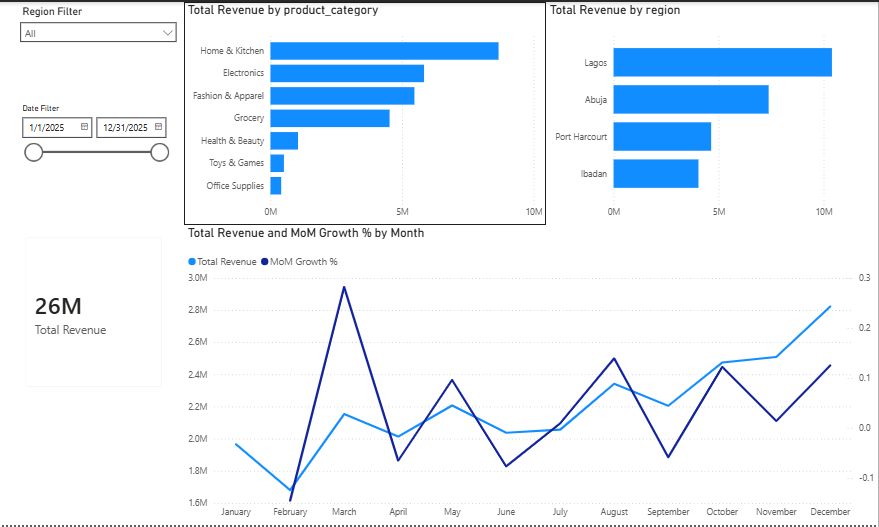
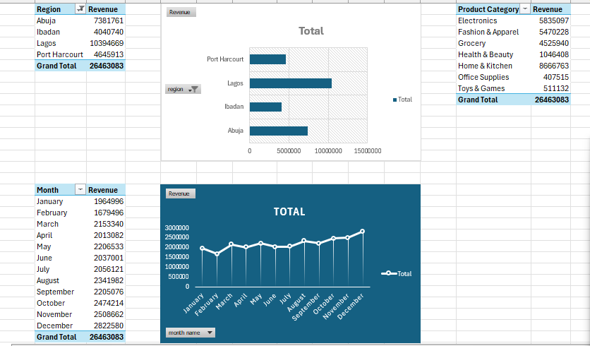

```markdown
# Retail Sales Performance Analysis (SQL → Excel → Power BI)

> **Summary:** An end-to-end data analytics project evaluating regional performance, product category revenue drivers, and monthly growth trends for a multi-city Nigerian retail business.

---

## 1. Business Questions
[cite_start]Bloom Mart operates retail locations across four commercial hubs in Nigeria: **Lagos, Abuja, Port Harcourt, and Ibadan**[cite: 99, 206]. Management commissioned this analysis to resolve key operational and strategic questions:
* [cite_start]Which geographical regions generate the highest sales volume and revenue[cite: 100, 210]?
* [cite_start]Which product categories serve as the primary revenue engines versus underperforming segments[cite: 100, 211]?
* [cite_start]How does sales revenue trend month-over-month (MoM) throughout the financial year[cite: 100, 212]?
* [cite_start]Where should management focus upcoming marketing spend and inventory budget for maximum ROI[cite: 100, 207]?

---

## 2. Tools Used
* [cite_start]**SQL (PostgreSQL):** Relational data loading, schema constraint management, business metric aggregations, and window functions[cite: 4, 105, 229, 243].
* [cite_start]**Microsoft Excel:** Data cleaning, type enforcement, multi-dimensional PivotTables, and cross-tool metric reconciliation [cite: 4, 135-137, 230, 274, 281].
* [cite_start]**Power BI:** Dynamic calendar modeling (`CALENDARAUTO`), time-intelligence DAX measures (`MoM Growth %`), and interactive dashboarding [cite: 4, 145-148, 230, 306].
* [cite_start]**Git & GitHub:** Version control, structured repository organization, and documentation[cite: 3, 231].

---

## 3. Data Source & Dataset Description
* [cite_start]**Source:** Granular transaction records (`Data/retail_sales_raw.csv`) [cite: 63-64, 215, 332-333].
* [cite_start]**Shape & Scope:** 2,000+ transaction records spanning the full 2025 calendar year across 4 store locations[cite: 99, 102, 206].
* [cite_start]**Key Fields:** `order_id`, `order_date`, `region`, `store_name`, `product_category`, `product_name`, `quantity`, `unit_price_ngn`, `total_sales_ngn`, and `customer_segment` [cite: 103, 217-226].
* *Note on Granularity:* Individual `order_id` values represent single carts containing multiple product line items; line items were preserved during data cleaning to maintain accurate unit and revenue totals.

---

## 4. Analytical Process (Pipeline Walkthrough)

### A. SQL Database Analysis
* [cite_start]Loaded raw CSV into a PostgreSQL database[cite: 105, 243].
* Refactored date parsing queries to PostgreSQL native `TO_CHAR(order_date, 'YYYY-MM')` and `DATE_TRUNC()` for monthly time-series analysis.
* Handled optional columns cleanly using `ALTER TABLE ... ALTER COLUMN ... DROP NOT NULL`.
* [cite_start]Queried regional revenue, top 5 product categories, and monthly order counts, exporting structured summaries for Excel validation [cite: 107-132, 235, 248-270].

```sql
-- Monthly Revenue Aggregation
SELECT 
    TO_CHAR(order_date, 'YYYY-MM') AS sales_month,
    SUM(total_sales_ngn) AS monthly_revenue
FROM sales
GROUP BY sales_month
ORDER BY sales_month ASC;

```

### B. Excel Cleaning & Verification

* Standardized text casing and removed whitespace using `=TRIM(CLEAN())`.
* Converted text-stored dates into proper date serial numbers via **Text-to-Columns** and `DATEVALUE`.
* Built multi-dimensional PivotTables to summarize sales by region, category, and month .


* 
**Cross-Tool Reconciliation:** Verified that total Excel revenue matched SQL database output to the exact kobo (**₦26,463,083**), confirming zero data drift .


### C. Power BI Modeling & DAX Measures

* Ingested the validated dataset and engineered a dedicated dynamic Date dimension using `CALENDARAUTO()`:

```dax
Date = 
ADDCOLUMNS(
    CALENDARAUTO();
    "Year"; YEAR([Date]);
    "Month"; FORMAT([Date]; "mmmm");
    "MonthNumber"; MONTH([Date]);
    "YearMonth"; FORMAT([Date]; "yyyy-mm")
)

```

* Linked the `Date` table to `'public CLEANED DATA'[order_date]` in a `1:*` active relationship and sorted the `Month` column chronologically via `MonthNumber`.
* Built custom time-intelligence measures to compute period-over-period growth :


```dax
Total Revenue = SUM('public CLEANED DATA'[total_sales_ngn])

MoM Growth % = 
VAR CurrentMonth = [Total Revenue]
VAR PriorMonth =
    CALCULATE(
        [Total Revenue];
        DATEADD('Date'[Date]; -1; MONTH)
    )
RETURN
    DIVIDE(CurrentMonth - PriorMonth; PriorMonth)

```

---

## 5. Dashboard & Key Visuals

### Power BI Executive Overview


### Excel Pivot Summary & Reconciliation


---

## 6. Key Findings & Business Insights

1. **Lagos & Abuja Drive Over Two-Thirds of Revenue:**
* **Lagos (₦10.39M)** and **Abuja (₦7.38M)** collectively account for **67.2%** of overall revenue (₦17.77M of ₦26.46M total).
* **Port Harcourt (₦4.65M)** and **Ibadan (₦4.04M)** represent stable baseline markets with strong potential for basket-size expansion.


2. **Heavy Category Concentration in Home Goods & Tech:**
* **Home & Kitchen (₦8.67M)**, **Electronics (₦5.84M)**, and **Fashion & Apparel (₦5.47M)** generate **75.5%** of all sales.
* **Office Supplies (₦407.5K)** and **Toys & Games (₦511.1K)** underperform, contributing less than **4%** combined.


3. **Strong Q4 Sales Acceleration:**
* Monthly revenue remains stable from April through July (~₦2.0M–₦2.2M monthly) before climbing steadily through Q3 and Q4, peaking in **December at ₦2.82M** (+68% higher than February’s low of ₦1.68M).


---

## 7. Recommended Business Actions

* 
**Reallocate Marketing Budget:** Channel Q3/Q4 promotional campaigns toward top-margin *Home & Kitchen* and *Electronics* bundles in Lagos and Abuja .


* 
**Rationalize Low-Margin Inventory:** Reduce warehouse holding space and restocking frequency for *Office Supplies* and *Toys & Games*, freeing working capital for faster-moving goods.


* 
**Regional Loyalty Push in Port Harcourt:** Implement customer retention programs in Port Harcourt to boost average order value.


---

## 8. Repository File Structure

```text
Retail-sales-sql-excel-powerbi/
│
├── README.md
├── Data/
│   └── retail_sales_raw.csv
├── Sql/
│   └── analysis_queries.sql
├── Excel/
│   └── retail_sales_cleaned_analysis.xlsx
├── Power bi/
│   └── retail_sales_dashboard.pbix
└── Screenshots/
    ├── POWER BI ANALYSIS.png
    └── PIVOT TABLE SUMMARY.png

```

---

## 9. What I Would Do Next (With More Time & Data)

* **Customer Lifetime Value & RFM Segmentation:** Incorporate customer identifiers to conduct Recency, Frequency, and Monetary (RFM) modeling to isolate VIP shopper cohorts.
* **Profit Margin & COGS Analysis:** Ingest Cost of Goods Sold (COGS) data to analyze net margin by category rather than relying solely on gross top-line revenue.
* **Automated Data Pipeline:** Build a scheduled Python or Power BI Service refresh pipeline to ingest daily transactions automatically from the PostgreSQL production database.

```

```